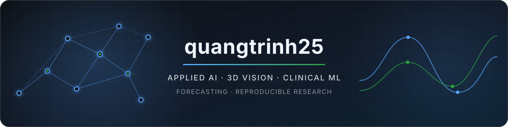

  

  
  

## Hello — I build applied AI systems that survive real data

My work sits where machine learning meets noisy, imperfect evidence: sparse camera views, irregular clinical events, changing demand, and sensor measurements. I care about reproducible experiments, honest evaluation, and turning research ideas into systems that can actually be inspected and rerun.

- **3D vision:** novel-view synthesis, 3D Gaussian Splatting, Scaffold-GS, camera geometry, and thin-structure reconstruction
- **Clinical ML:** temporal-robust ICU risk prediction with event-token sequence models and boosted trees
- **Forecasting:** explainable demand forecasting with rolling backtests and model ensembles
- **Scientific ML:** electromagnetic localization, structured data pipelines, and reproducible benchmarking

<!-- PERSONALIZE: Add your public name, location, website, LinkedIn, or email here when ready. -->

## Featured work

<table>
  <tr>
    <td width="50%" valign="top">
      <h3><a href="https://github.com/quangtrinh25/var2026-bts-nvs">VAR2026 BTS Novel View Synthesis</a></h3>
      
Scene-selective 3DGS and Scaffold-GS research pipeline for difficult telecom-tower reconstruction, including thin lattice structures, weak view support, and production-gated render fusion.

      
<code>3DGS</code> <code>Scaffold-GS</code> <code>PyTorch</code> <code>CUDA</code>

    </td>
    <td width="50%" valign="top">
      <h3><a href="https://github.com/quangtrinh25/maboost">MaBoost for ICU Early Prediction</a></h3>
      
A temporal-robust clinical prediction system combining event-token Mamba representations with gradient-boosted decision trees for ICU risk modelling.

      
<code>Mamba</code> <code>XGBoost</code> <code>MIMIC-IV</code> <code>Explainability</code>

    </td>
  </tr>
  <tr>
    <td width="50%" valign="top">
      <h3><a href="https://github.com/quangtrinh25/vin_datathon">Retail Demand Forecasting</a></h3>
      
An end-to-end forecasting workflow for Vietnamese fashion retail, built around feature engineering, rolling validation, and practical ensembling.

      
<code>LightGBM</code> <code>Ridge</code> <code>Time Series</code> <code>Backtesting</code>

    </td>
    <td width="50%" valign="top">
      <h3><a href="https://github.com/quangtrinh25/EMF">Electromagnetic 6-DoF Localization</a></h3>
      
A structured-learning approach to wireless-capsule localization from electromagnetic measurements, with fast Polars pipelines and boosted-tree models.

      
<code>Polars</code> <code>AdaBoost</code> <code>XGBoost</code> <code>Sensor ML</code>

    </td>
  </tr>
</table>

## Toolbox

  
  
  
  
  
  
  
  
  
  
  
  

## GitHub snapshot

  
  

---

  Research is strongest when every claim has an experiment behind it.

